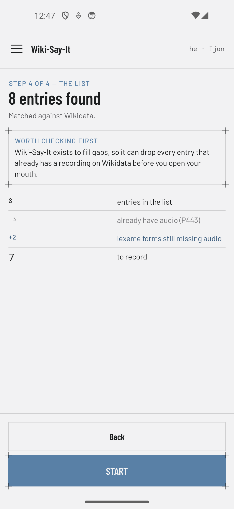
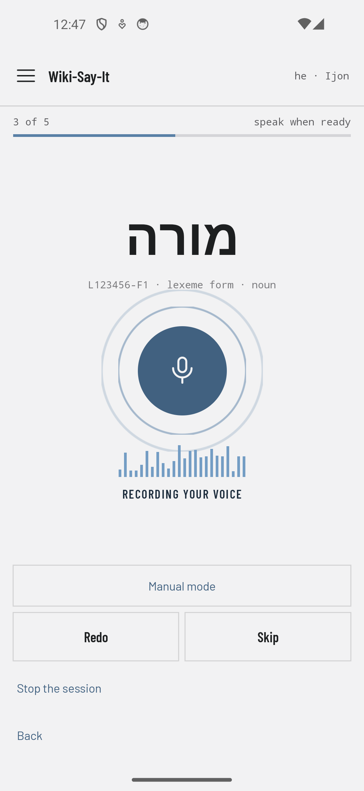
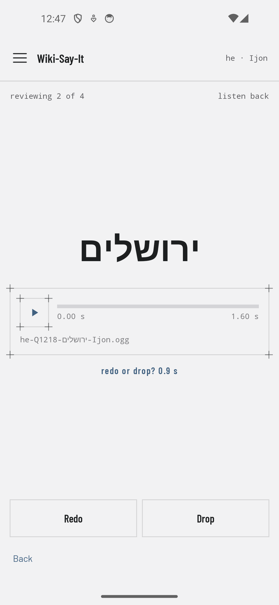
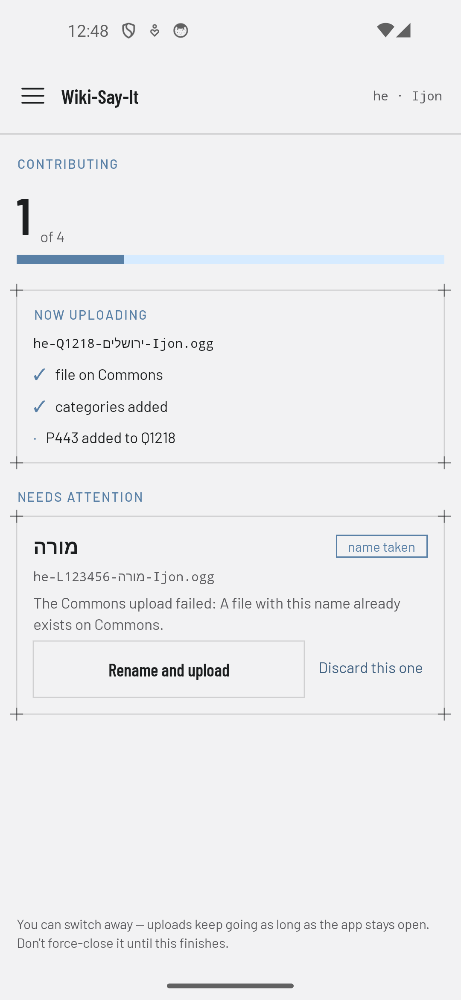

# Wiki-Say-It!

**Record pronunciations of words, names, and phrases in your language, and contribute them to [Wikimedia Commons](https://commons.wikimedia.org/) and [Wikidata](https://www.wikidata.org/), from your Android phone.**

Wiki-Say-It! is inspired by [Lingua Libre](https://lingualibre.org/), the browser-based tool the Wikimedia community uses to record pronunciations for the free-knowledge commons. It takes the Lingua Libre flow (pick a list, record it quickly, review, publish) and puts it on your phone, so you can record whenever you have a few spare minutes and a quiet corner.

<p align="center">
  
  
  
  
</p>

## Free, no ads, no tracking

- **Completely free.** No price, no in-app purchases, no premium tier. It's free and open-source software under the [Apache License 2.0](LICENSE), written by a volunteer as a public service with no financial motive.
- **No ads, ever.**
- **Nothing is collected from your device except the recordings you choose to contribute.** No analytics, no crash reporting, no "phoning home". The app talks only to Wikimedia sites (Commons, Wikidata, Wikipedia, and the Wikimedia sign-in service), and the only thing it sends them is what you'd expect: the recordings you approved, plus the Wikidata edits linking them. Your profiles, statistics, and skipped words stay on your device. The only permissions it asks for are the microphone and internet access. See [PRIVACY](PRIVACY).

## How it works

1. **Sign in** with your Wikimedia account. Sign-in uses OAuth, so the app never sees your password.
2. **Set up a speaker profile** with the languages you speak, how well you speak each one (native or proficient), and your dialect or region if you have one. You can keep several profiles on one device, for example when more than one person records on the same phone.
3. **Pick the language** you want to record in.
4. **Build a list** of things to record, from any of these sources:
   - **Your own list:** paste words, names, or phrases, one per line, and match them to Wikidata items or lexemes. If a word matches more than one item or lexeme, you choose the right one.
   - **A Wikidata query:** paste a SPARQL query that returns items or lexemes, or start from a prepackaged one (all lexemes, nouns, verbs, adjectives, adverbs, phrases). If a label is missing in your language, the app uses the item's default label.
   - **A Wikipedia category:** pull in the pages of a category, optionally including subcategories up to five levels deep.
5. **Skip what's already done.** The app checks Wikidata and drops entries that already have a pronunciation recording. For lexemes it checks each form separately, so you only record what's missing.
6. **Record.** Entries appear one at a time in large type. In automatic mode the app notices when you start speaking and when you stop, then moves to the next entry on its own. Manual mode is there if you'd rather control each recording yourself. Tap **Redo** to record an entry again, or **Skip** to leave it out.
7. **Review.** Each take is played back to you. Keep it, queue it to be recorded again, or drop it.
8. **Contribute.** Your approved recordings are:
   - trimmed of silence and background noise, padded with a short moment of silence at each end, and encoded as Ogg Vorbis;
   - uploaded to Wikimedia Commons under the [CC0](https://creativecommons.org/publicdomain/zero/1.0/) public-domain dedication, with consistent file names (for example `he-Q432522-יונתן רטוש-Ijon.ogg`) and categories;
   - linked from Wikidata with a *pronunciation audio* ([P443](https://www.wikidata.org/wiki/Property:P443)) statement, on the item itself or on the exact lexeme form you recorded.
9. **Done.** Jump to your Commons or Wikidata contributions to see what you added, or start a new session.

## More features

- **Resilient uploads.** If a contribution is interrupted (lost connection, app closed), it picks up where it left off without uploading anything twice. A *Recovery mode* can also go through your recent Commons uploads and add any Wikidata links that are missing.
- **Recording statistics**, broken down by items and lexeme forms, per month and year.
- **Adjustable settings:** silence trimming, how long a pause ends a recording, maximum list size, automatically using your last profile, and managing words you've skipped.
- **Translated and RTL-ready.** The interface is translated by volunteers on [translatewiki.net](https://translatewiki.net), and right-to-left languages mirror the whole layout.

## Building

Wiki-Say-It! is a native Android app (Kotlin, Jetpack Compose) that runs on Android 8.0 (API 26) and later.

```bash
./gradlew assembleDebug   # build a debug APK
./gradlew test            # run unit tests
./gradlew ktlintCheck     # check formatting
```

## Contributing

Bug reports, feature requests, and pull requests are welcome. See [CONTRIBUTING.md](CONTRIBUTING.md). To help translate the app, join [translatewiki.net](https://translatewiki.net) rather than editing the translation files directly.

## Credits and license

Wiki-Say-It! is inspired by [Lingua Libre](https://lingualibre.org/) and its excellent browser-based recording flow. It is developed by Asaf Bartov. Ogg Vorbis encoding uses Alexey Kuznetsov's [android-vorbis](https://gitlab.com/axet/android-vorbis) (LGPL-3.0). See [CREDITS](CREDITS).

Licensed under the [Apache License 2.0](LICENSE). Recordings you contribute are published under CC0.
